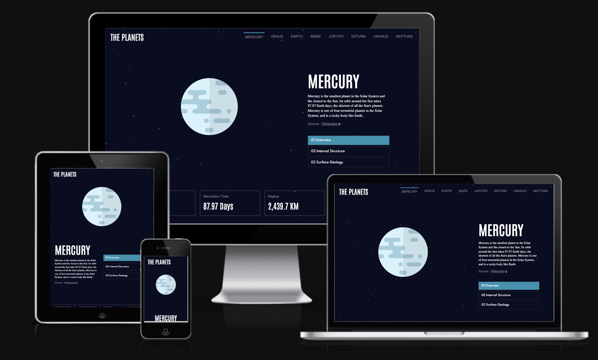
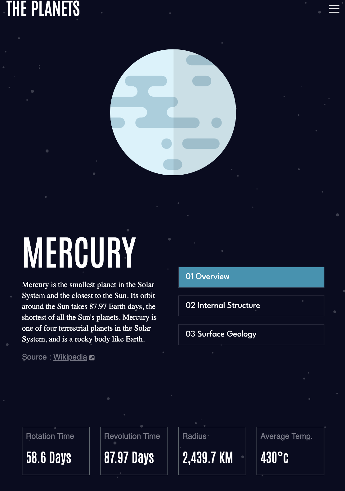
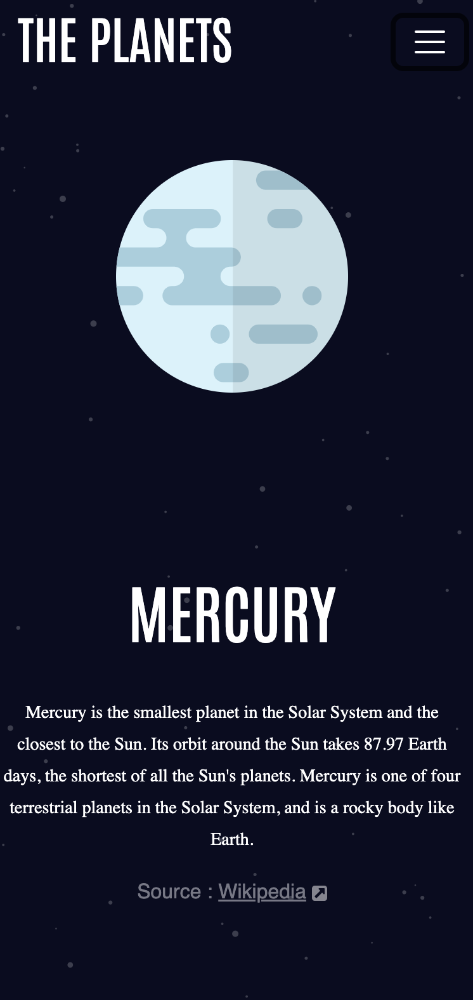

# Frontend Mentor - Planets fact site solution

This is a solution to the [Planets fact site challenge on Frontend Mentor](https://www.frontendmentor.io/challenges/planets-fact-site-gazqN8w_f). Frontend Mentor challenges help you improve your coding skills by building realistic projects. 

## Table of contents

- [Overview](#overview)
  - [The challenge](#the-challenge)
  - [Screenshot](#screenshot)
  - [Links](#links)
- [My process](#my-process)
  - [Built with](#built-with)
  - [What I learned](#what-i-learned)
  - [Continued development](#continued-development)
  - [Useful resources](#useful-resources)
- [Author](#author)


## Overview

### The challenge

Users should be able to:

- View the optimal layout for the app depending on their device's screen size
- See hover states for all interactive elements on the page
- View each planet page and toggle between "Overview", "Internal Structure", and "Surface Geology"

### Screenshot





### Links

- Solution URL: [Add solution URL here](https://your-solution-url.com)
- Live Site URL: [Add live site URL here](https://j-r77-stack.github.io/planets-fact-site/index.html)

## My process

### Built with

- Semantic HTML5 markup
- CSS custom properties
- Mobile-first workflow
- [Bootstrap5](https://getbootstrap.com/)
- [Google Fonts](https://fonts.google.com/)
- [Git](https://git-scm.com/)
      * Used for version control.
- [JSON](https://www.json.org/json-en.html)
      * used to add info to the page from a json file. 
- [GitHub](https://github.com/)
      * Used to store the code once pushed from Git. 


### What I learned

It was good to learn how to change the colour for the toggler icon for smaller size pages in bootstrap 5 by adding my own custom css
```css
.navbar-toggler-icon {
    background-image: url("data:image/svg+xml,%3csvg xmlns='http://www.w3.org/2000/svg' viewBox='0 0 30 30'%3e%3cpath stroke='rgba%28255, 255, 255, 1%29' stroke-linecap='round' stroke-miterlimit='10' stroke-width='2' d='M4 7h22M4 15h22M4 23h22'/%3e%3c/svg%3e")
}
```
I enjoyed working with JSON by using the code below to take data from a JSON file and render it to the page. 
```js
  <p id="p-earth">
                            <script>
                                fetch("data.json")
                                    .then(response => response.json())
                                    .then(data => {
                                        console.log(data[2].name)
                                        document.querySelector("#p-earth").innerText = data[2].structure.content
                                    })
                            </script>
                        </p>
```

### Continued development

Continue to practice JavaScript and try and build a most of a whole site with a JSON file as I didn't use it enough of the data with this site.

### Useful resources

- [Example resource 1](https://www.youtube.com/watch?v=C3dfjyft_m4) - This helped me to understand how to get data from a JSON file into my webpage. 
- [Example resource 2](https://www.youtube.com/watch?v=45QSuJaHEss) - This is an amazing article which helped me change the color of the hambuger icon in bootstrap5. I'd recommend it to anyone still learning this concept.
- [w3schools](https://www.w3schools.com/) - A great webpage for someone beginning their journey with code.
- [stackoverflow](https://stackoverflow.com/) - Another very useful site.


## Author

- Frontend Mentor - [@J-R77-stack](https://www.frontendmentor.io/profile/J-R77-stack)
- Linkedin - [@johnny-ramsay](https://www.linkedin.com/in/johnny-ramsay-developer/)


